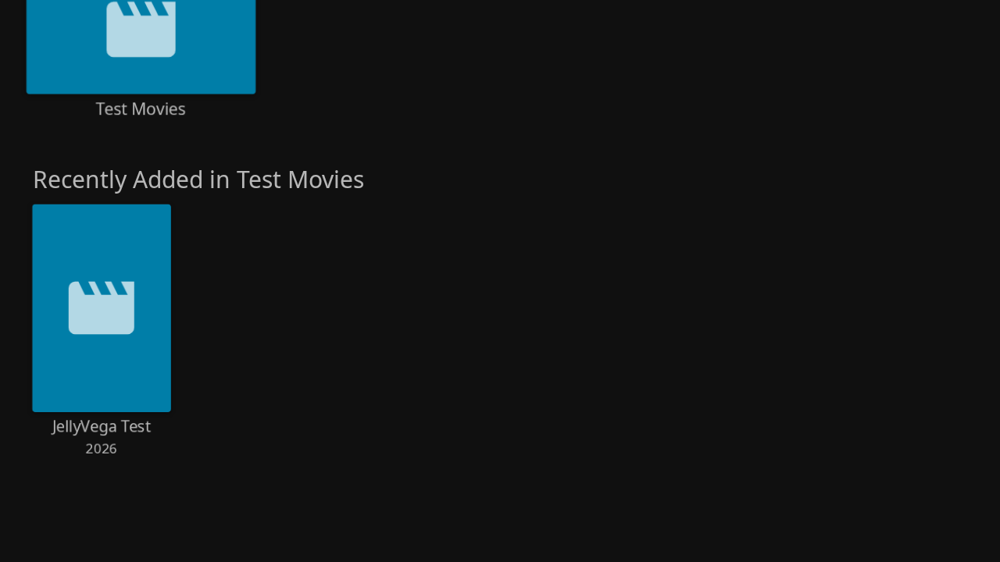

# JellyVega

[](https://github.com/looizao/jellyfin-vega-tailnet/actions/workflows/ci.yml)
[](https://github.com/looizao/jellyfin-vega-tailnet/releases)

Jellyfin over your home tailnet, in **one ARMv7 Vega `.vpkg`** for the **Fire TV Stick HD, 2nd generation (2026)**.

JellyVega embeds Tailscale's official `tsnet` engine and opens your server's matching Jellyfin Web interface in Amazon's media-capable WebView. Enrollment, browsing, sign-in, video, subtitles, and WebSocket traffic stay in the app's connection. No public Jellyfin port or separate Tailscale app is needed. The Jellyfin server continues running at home.

**Status: device-testing preview.** Native packaging and local network/browser tests are automated. Playback and remote behavior on a physical Fire TV still need verification. Amazon Developer Mode is required for installation; this is not an Amazon Appstore listing.



## Install

1. Download the `.vpkg` and `SHA256SUMS` from [Releases](https://github.com/looizao/jellyfin-vega-tailnet/releases).
2. Follow [INSTALL.md](docs/INSTALL.md) to enable Amazon Developer Mode and connect the stick.
3. Verify the downloaded package against its entry in `SHA256SUMS`, then run:

   ```sh
   vega device list
   vega device -d DEVICE_SERIAL install-app --packagePath JellyVega-0.1.1-armv7.vpkg
   vega device -d DEVICE_SERIAL launch-app --appName com.looizao.jellyvega.main
   ```

4. Enter your **server root**, for example `http://nas:8096`, `http://100.101.102.103:8096`, or `https://nas.example.ts.net`. A configured base path such as `/jellyfin` is supported. Omit `/web` and login tokens.
5. Select **Connect to tailnet**, open the displayed login URL on your phone/computer, and approve the TV in your home tailnet. Alternatively, enter a one-off Tailscale auth key. Select **Open Jellyfin**, then sign in to Jellyfin normally.

The server must be a Tailscale device accessible to this TV through your tailnet policy. Names resolve from the authenticated Tailscale network map. LAN IPs, subnet-router-only servers, public URLs, and external media redirects are outside this preview's supported configuration.

Use the directional pad and Select in Jellyfin. Back returns through Jellyfin's screens. Menu (☰) returns to connection settings. Home exits to the launcher. Enrollment identity and sign-in persist across launches; disconnecting preserves identity.

## Build and test

Pinned toolchain: Vega SDK **0.22.5850**, Node **22.22.0**, Go **1.26.8**, React Native **0.72**, WebView **3.5.11**, Tailscale **1.102.4**.

```sh
npm ci --ignore-scripts
npm run verify             # TypeScript, Jest, Go race/integration tests, C ABI
npm run audit:go           # Reachable Go vulnerability analysis
node scripts/audit-npm.mjs # Checks documented upstream SDK exceptions
npx playwright install chromium
npm run test:browser       # Docker Jellyfin + two real tsnet nodes + Chromium
source "$HOME/vega/env"
npm run build:release
bash scripts/stage-release.sh
```

The browser test creates a disposable Jellyfin 12 server and synthetic H.264/AAC movie; it needs Docker and free local ports 18096 and 18765. No real credentials are used. See [TESTING.md](docs/TESTING.md).

On Linux, use the included Ubuntu builder when the host is not supported by Amazon:

```sh
docker build -f tooling/Dockerfile -t jellyvega-builder:0.22.5850 .
docker run --rm -v "$PWD:/work" jellyvega-builder:0.22.5850
```

The container writes build outputs as root. A native SDK build on Ubuntu 22.04 avoids this ownership difference. Packages appear in `build/armv7-release/`; staged artifacts in `dist/`.

## CI and releases

Every pull request and main push runs source checks, race tests, real local-tailnet tests, native C ABI tests, vulnerability checks, and real Jellyfin browser playback. CI then builds and validates the ARMv7 VPKG. Version tags run the same checks before publishing a preview release with SHA-256 checksums, package metadata, dependency inventory/SBOM, and third-party licenses. Failed checks prevent publication.

Read [ARCHITECTURE.md](docs/ARCHITECTURE.md), [SECURITY.md](SECURITY.md), and [CONTRIBUTING.md](CONTRIBUTING.md). The pinned Amazon/React Native dependency tree has documented upstream advisories; these are explicit exceptions, not repaired dependencies.

## Credits and license

Based on [looizao/tailscale-vegaos](https://github.com/looizao/tailscale-vegaos), with a new `tsnet` gateway and Jellyfin integration. Original code is MIT licensed. Tailscale is BSD-3-Clause; Amazon packages retain their license terms. Jellyfin Web is provided by your own server and retains its upstream license. Notices are included inside each VPKG and as a release artifact.

Independent community project, unaffiliated with Amazon, Jellyfin, or Tailscale. Platform references: [Amazon WebView](https://developer.amazon.com/docs/vega/0.22/overview-of-webview), [Developer Mode](https://developer.amazon.com/docs/vega/0.24/developer-mode), [Tailscale tsnet](https://tailscale.com/docs/features/tsnet).
