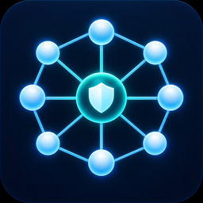

# TailVega

[](https://github.com/looizao/tailscale-vegaos/actions/workflows/ci.yml)
[](https://github.com/looizao/tailscale-vegaos/actions/workflows/release.yml)
[](https://github.com/looizao/tailscale-vegaos/releases/latest)
[](LICENSE)



TailVega is an experimental Tailscale client for the 2026 Fire TV Stick HD (2nd Generation) running Vega OS 1.1. It embeds the official open-source Tailscale userspace engine in a Vega React Native app and builds an ARMv7 `.vpkg` that can be sideloaded in Developer Mode.

> [!IMPORTANT]
> TailVega is a userspace tailnet node, not a device-wide VPN. Vega OS does not expose a public VPN or TUN API to third-party apps. TailVega can reach tailnet services through its built-in TCP probe and exposes a password-protected SOCKS5 endpoint to clients that can explicitly use it. It cannot transparently route Fire TV apps, advertise routes, or act as an exit node.

## What works

- Joins a tailnet with a one-off Tailscale auth key.
- Persists node identity in the app's private data directory and resumes it on later launches.
- Shows the node name, MagicDNS name, addresses, tailnet, and online peer count.
- Opens TCP connections to tailnet services from the native app.
- Starts a local, password-protected SOCKS5 endpoint from `tsnet`.
- Stops the embedded node without deleting its saved identity.

The project targets ARMv7, Vega OS 1.1, Vega SDK `0.22.5850`, React Native `0.72`, Go `1.25.5`, and `libtailscale` commit `80771313ac4127973677c993889fe215abcf1fbd` (Tailscale `v1.94.1`).

## Install on Fire TV

1. Download `TailVega-<version>-armv7.vpkg` and its checksum from the [latest release](https://github.com/looizao/tailscale-vegaos/releases/latest).
2. Install Vega SDK `0.22.5850` on a supported Linux development machine.
3. Enable Developer Mode on the Fire TV Stick and connect it over USB.
4. Verify and install the package:

   ```bash
   sha256sum -c TailVega-<version>-armv7.vpkg.sha256
   vega device list
   vega device install-app --packagePath TailVega-<version>-armv7.vpkg
   vega device launch-app --appName com.looizao.tailvega.main
   ```

5. In the Tailscale admin console, create a one-off auth key with the shortest practical expiry. Select **Pre-approved** only if your tailnet uses device approval. Do not make the key ephemeral, because TailVega persists its node identity.
6. Open TailVega, enter the key, and select **Connect**. The key is cleared from the UI and native input buffer after configuration.

See the [complete setup and installation guide](docs/INSTALL.md), including Developer Mode activation and troubleshooting.

## Build from source

Prerequisites are Node.js 20, npm, Go 1.25.5, a C/C++ toolchain, and Vega SDK `0.22.5850`. The SDK's supported host is Ubuntu 22.04.

```bash
git clone --recurse-submodules https://github.com/looizao/tailscale-vegaos.git
cd tailscale-vegaos
npm ci --ignore-scripts
npm run verify
source "$HOME/vega/env"
npm run build:release
```

The package is written under `build/armv7-release/`. The native host smoke test validates the C ABI and engine lifecycle, while GitHub Actions performs the authoritative Vega ARMv7 package build and validation.

## Architecture

```text
Vega React Native TV UI
          |
          v
Kepler Turbo Module (C++)
          |
          v
libtailscale C ABI -> tsnet userspace engine -> tailnet
```

Read [Architecture](docs/ARCHITECTURE.md) for the trust boundaries and platform limitations.

## Security

Treat the release `.vpkg` like any other network client. Verify its SHA-256 file, use a one-off key, restrict the node with Tailscale grants or ACLs, and revoke unexpected nodes in the admin console. See [SECURITY.md](SECURITY.md) for the threat model and reporting process.

## Status and support

This is an independent, community-maintained port. It is not affiliated with or supported by Tailscale Inc., Amazon.com, Inc., or their affiliates. Tailscale is a registered trademark of Tailscale Inc.; Amazon, Fire TV, and Vega are trademarks of their respective owners.

Physical-device validation requires a Developer Mode enabled Fire TV Stick HD (2nd Generation). Please include the Vega OS build, TailVega release, and relevant device logs when filing an issue.

## License

TailVega's original code is licensed under the [MIT License](LICENSE). The `libtailscale` submodule and its transitive dependencies retain their own licenses. See [THIRD_PARTY_NOTICES.md](THIRD_PARTY_NOTICES.md).
