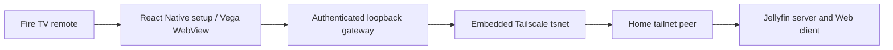

# Architecture

The C++ Turbo Module exposes asynchronous start, status, stop, and connectivity-check methods. A Go C archive owns a `tsnet.Server`, node identity, and one reverse proxy. It is linked into the Vega native module and packaged with the React Native app. No separately installed daemon is needed. Native work runs away from the JavaScript thread; the last native worker releases the engine owner and closes its streams.

The gateway listens on `127.0.0.1:18765`. Its only upstream is the configured Jellyfin origin/base path. A 256-bit random bootstrap credential sets an HttpOnly, SameSite session cookie before entering `/web/index.html`; the token is never sent to Jellyfin. Cookie authentication covers API requests, media, and WebSocket upgrades. Host/Origin validation, a restrictive content security policy, and native navigation checks prevent requests from moving outside that route.

All outgoing dials resolve a numeric Tailscale address or match a peer in Tailscale's authenticated network map. The gateway then calls `tsnet.Dial` with a Tailscale IP. It does not fall back to public DNS, a LAN socket, or an environment HTTP proxy. TLS certificate validation still uses the original server hostname. The Tailscale ACL/grant layer remains authoritative.

Standard HTTP reverse proxying preserves Range/206 streaming, HLS requests, POST bodies, authorization, and WebSocket upgrades. Connections stream without buffering whole movies. Connection/header timeouts bound failures; streaming bodies have no fixed overall timeout. Shutdown explicitly closes upgraded connections as well as ordinary HTTP streams. Absolute same-server redirects become local redirects; external redirects are refused. Jellyfin plugins/assets that require third-party origins are blocked.

The matching Web client comes from the configured server. Only its HTML entry page is buffered (maximum 4 MiB) to insert a small adapter before application scripts. The adapter selects Jellyfin's TV layout and maps Menu to native settings. Server changes clear browser storage before Jellyfin runs, preventing credentials from the previous server being reused. The stable local origin preserves sign-in on ordinary reconnects. Service-worker installation is disabled so a cached web application cannot bypass that server-change boundary.

Private native data is in `/home/app_user/packages/com.looizao.jellyvega/data/`. `settings.json` stores only server URL and node name with mode 0600. Tailscale's own state store persists device identity. Enrollment keys remain memory-only inputs. The operating system controls WebView storage and app process lifetime. A killed process reconnects on the next launch; background playback and continuous operation while other apps run are not promised.

## Source map

- `native/gateway/`: authenticated single-server proxy and TV adapter.
- `native/engine/`: Tailscale lifecycle, state, peer resolution, server probe.
- `native/bridge/`: owned C strings and a small C ABI.
- `kepler/`: generated Turbo Module bindings and C++ worker lifetime.
- `src/`: TV setup and WebView lifecycle.
- `scripts/`: deterministic checks, SDK/bootstrap tooling, device install and release staging.

The test-only local coordination/DERP server is behind a Go build tag and is absent from the release bridge. Developer credentials, test accounts, the Jellyfin server, and media are never included in a VPKG.
