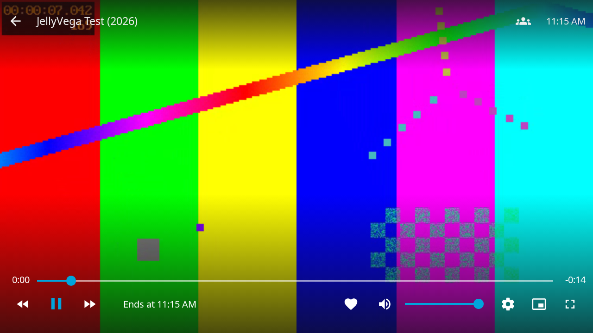

# Validation

## Automated checks

`npm run verify` runs ESLint (no warnings), strict TypeScript, Jest, generated-binding comparison, Go vet, race-enabled unit tests, a real local tailnet integration test, and a compiled C ABI lifecycle smoke test.

The integration suite starts two independent tsnet engines, a local Tailscale test coordination server, DERP, and STUN. It verifies HTTP, the injected TV entry page, a streamed Range/206 seek, saved-state permissions, and identity reuse after reconnect. It requires no TUN, root, or production credentials. Proxy tests cover authentication, host/origin/path attacks, credential stripping, external redirects, WebSocket upgrade/echo, and closing upgraded streams.

`npm run test:browser` uses a digest-pinned Jellyfin 12 Docker image, a generated 15-second H.264/AAC test movie, the real local tailnet, and Chromium. It configures a disposable user, signs into the TV web interface, navigates the library, starts video, seeks, and checks that all browser HTTP requests stay on the local gateway. Test credentials/state are generated under ignored `.cache/` and removed on exit. Screenshots and traces are in ignored `test-results/` and `playwright-report/`.

`npm run audit:go` reports reachable vulnerabilities. `node scripts/audit-npm.mjs` fails on advisories outside the checked-in SDK exceptions; see SECURITY.md. Exceptions do not mean affected dependencies are fixed.

## Native packaging

`npm run build:release` uses Amazon's real ARMv7 toolchain. It links the Go archive into the Vega Turbo Module, bundles React Native and WebView support, includes dependency licenses, and creates the VPKG. `scripts/stage-release.sh` runs VPT validation and emits checksums, metadata, licenses, and an npm CycloneDX SBOM.

Local ARMv7 compilation has passed using `tooling/Dockerfile` on an x86_64 Linux host. The package can be inspected with `vega exec vpt info` and `vega exec vpt show-contents`.

## Remaining hardware validation

No physical Fire TV or home-tailnet credentials were provided during initial development. Desktop Chromium tests do not verify Vega's media sandbox, hardware decoder, remote key mapping, app lifecycle, or on-device performance. The release remains a preview until those checks pass. Follow the checklist in INSTALL.md and record OS build, model, server version, direct/relayed path, codecs, and playback duration.

## Initial local results — 2026-09-13

- 12 Jest tests passed, including the setup UI, auth-key clearing, approval polling, server errors, and server-change storage isolation.
- Go unit/race tests, real-tailnet reconnect/streaming tests, and the linked C ABI smoke test passed.
- Real Jellyfin Server 12.0.0 login, library navigation, H.264/AAC playback, and seeking passed in Chromium 153 through the embedded tailnet. External Chromecast loading was refused by CSP.
- ARMv7 release compilation and VPT validation passed with zero manifest errors. Licenses, SBOM/inventory, metadata, and SHA-256 files were staged successfully.
- Vega Virtual Device launch was attempted; the SDK installation has no VVD system image. No Vega emulator runtime result is claimed.
- Physical stick, real home tailnet, hardware decoding, subtitles on Vega, and long playback sessions remain untested.

